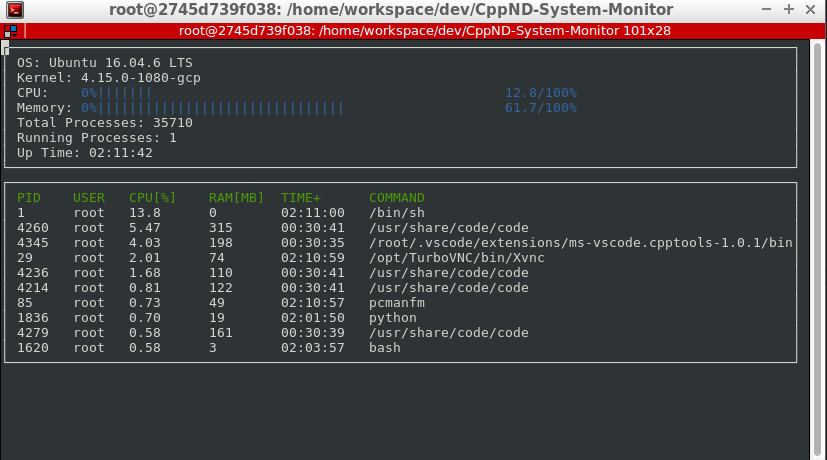

# CppND-System-Monitor

A basic and simple system monitor for Linux OS written in C++.

## ncurses
[ncurses](https://www.gnu.org/software/ncurses/) is a library that facilitates text-based graphical output in the terminal. This project relies on ncurses to display the output.

Install ncurses within your own Linux environment: `sudo apt install libncurses5-dev libncursesw5-dev`

## Instructions

1. Clone the project repository: `git clone https://github.com/udacity/CppND-System-Monitor-Project-Updated.git`

2. From the `root` directory, create a diretory called "build" and build the project by using the following commands in succession:
```
mkdir build
cd build
cmake ..
make
```

3. Run the resulting executable: `./build/monitor`. The executable should produce the following system monitor.



